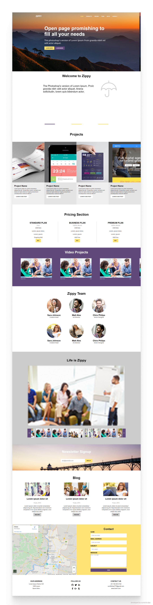

## 📌 Motive of the Project

<b>single-page-website</b> is a frontend project built in
for provideing user information .


### Installation

### 1. You need to clone (download) it to local machine using

```sh
$ git clone https://github.com/sumit-kr-das/single-page-website
```

### 2. Once you have cloned the `single-page-website` repository in Github, double click on `index.html` <-



